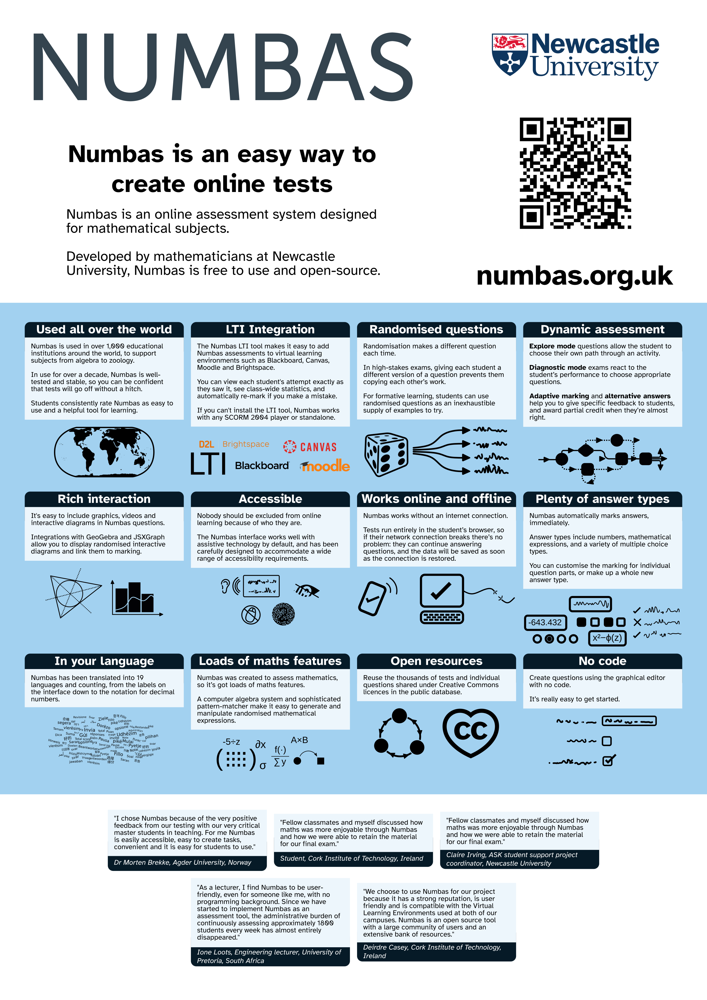

A poster about [Numbas](https://numbas.org.uk), an open-source e-assessment system.

It's designed to be printed at A2 size.

The file `numbas-poster.svg` is the source file; the PDF and PNG files are created from it.

This work is licensed under [CC BY 4.0](https://creativecommons.org/licenses/by/4.0). You are free to share and adapt this poster under the terms of the CC BY 4.0 licence.

